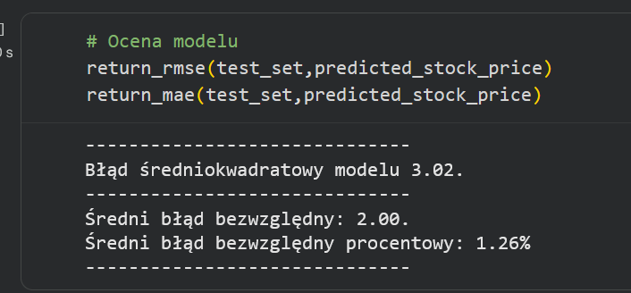
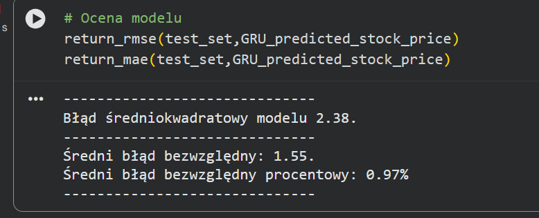
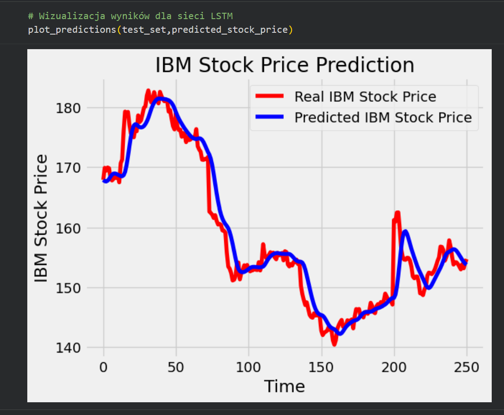
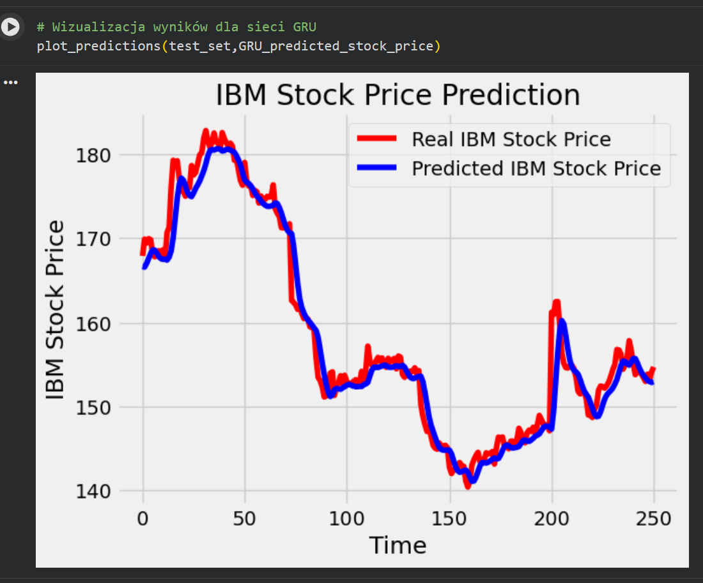
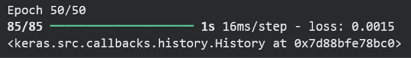
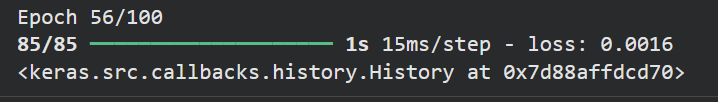

# Porównanie modeli LSTM i GRU dla danych IBM

Poniżej znajduje się krótkie porównanie wyników modeli LSTM i GRU wykonanych na danych akcji IBM, wraz ze screenami z predykcji, metryk i treningu.

## Wyniki predykcji

| Model | Screen z predykcji | RMSE | MAE | MAPE |
|---|---|---:|---:|---:|
| LSTM |  | 3.02 | 2.00 | 1.26% |
| GRU |  | 2.38 | 1.55 | 0.97% |

## Screeny z metrykami

| Model | Screen z metrykami |
|---|---|
| LSTM |  |
| GRU |  |

## Prędkość nauki

| Model | Screen z treningu | Obserwacja |
|---|---|---|
| LSTM |  | Trening zakończył się po 50/50 epokach, czas na krok to ok. 16 ms/step. |
| GRU |  | Early stopping zatrzymał naukę po 56/100 epokach, czas na krok to ok. 15 ms/step. |

## Podsumowanie

GRU wypada lepiej od LSTM, bo osiąga niższe błędy predykcji i uczy się nieco szybciej, więc w tym zadaniu jest korzystniejszą architekturą.

# Zadanie A: Poeksperymentuj z ilością jednostek LSTM.
