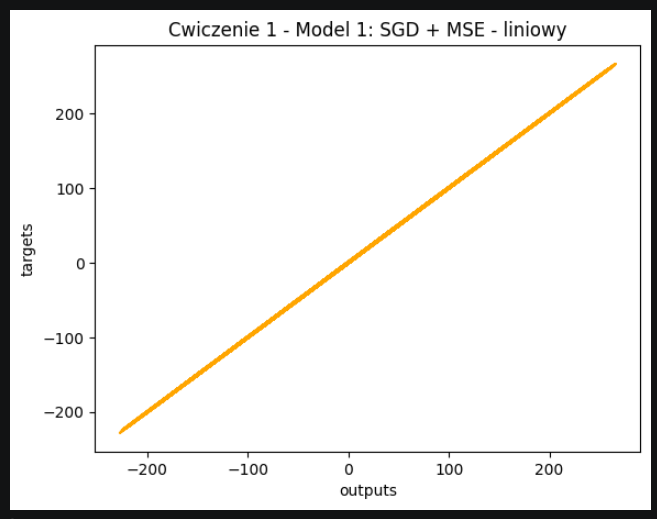
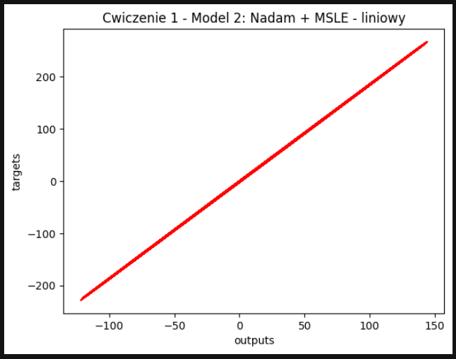
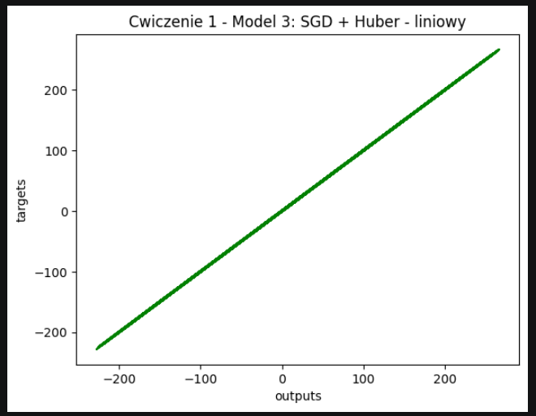
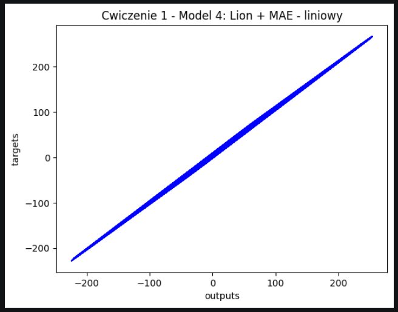
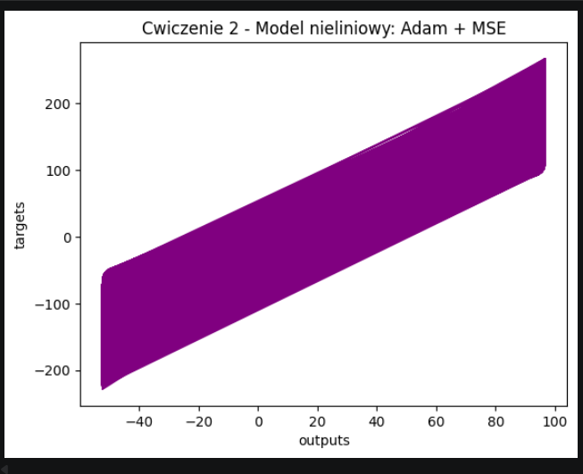

# Lab SI-2 – Regresja liniowa i nieliniowa z TensorFlow

Zbiór danych: `TF_dataset.npz` — dane syntetyczne według wzoru `targets = 10·xs − 15·zs + 20 + noise`.  
Zadanie: dopasować model do tej zależności i porównać różne optymalizatory oraz funkcje strat.

---

## Ćwiczenie 1 – Porównanie optymalizatorów i funkcji strat (model liniowy)

Każdy model to pojedyncza warstwa `Dense(1)` bez funkcji aktywacji — klasyczna regresja liniowa.

| Model | Optimizer | Funkcja straty | Epoki | Loss końcowy | Obserwacje |
|-------|-----------|----------------|-------|--------------|------------|
| Model 1 | SGD | MeanSquaredError | 50 | ~0.34 | Szybka zbieżność, nauczone wagi: [10.02, -14.99], bias: 20.01 — idealnie odwzorowuje wzór |
| Model 2 | Nadam | MeanSquaredLogarithmicError | 50 | ~0.20 | Dobra zbieżność, loss maleje równomiernie przez wszystkie epoki |
| Model 3 | SGD | Huber | 30 | ~0.168 | Bardzo szybka zbieżność do epoki 8, potem loss ustabilizowany |
| Model 4 | Lion | MeanAbsoluteError | 50 | ~5.58 | Wolniejsza zbieżność niż SGD, MAE oznacza średni błąd bezwzględny ~5.58 jednostek |

### Wykresy (outputs vs targets)

Wykres poprawnie wytrenowanego modelu powinien tworzyć linię prostą — każda predykcja równa się targetowi.

**Model 1 – SGD + MSE**

**Model 2 – Nadam + MSLE**

**Model 3 – SGD + Huber**

**Model 4 – Lion + MAE**

---

## Ćwiczenie 2 – Model nieliniowy (wiele warstw + funkcja aktywacji)

Architektura: `Dense(5, sigmoid)` → `Dense(5, sigmoid)` → `Dense(1)`  
Optimizer: `Lion` | Funkcja straty: `MeanSquaredError` | Epoki: 100 | Loss końcowy: ~2638

Dodanie ukrytych warstw z funkcją aktywacji **sigmoid** wprowadza nieliniowość — model może aproksymować bardziej złożone zależności niż prosta liniowa. Wysoki loss (~2638) wynika z tego, że sigmoid ogranicza wyjście do zakresu (0, 1), co w połączeniu z optymalizatorem Lion utrudnia naukę dla danych o dużym zakresie wartości. Pokazuje to, że dobór funkcji aktywacji ma kluczowe znaczenie dla jakości modelu.

**Model nieliniowy – Adam + MSE + ReLU**

---

## Wnioski

- Model liniowy (SGD + MSE) najlepiej dopasował się do danych — wyuczone wagi [10.02, -14.99, 20.01] niemal idealnie odwzorowują oryginalny wzór generujący dane.
- Nadam zbiega wolniej niż SGD na tym zbiorze, ale równomiernie przez wszystkie epoki.
- Huber loss powoduje szybką zbieżność na początku, ale zatrzymuje się wcześniej niż MSE.
- Model nieliniowy z sigmoid osiągnął bardzo wysoki loss (~2638) — sigmoid ogranicza aktywacje do (0,1), przez co sieć nie jest w stanie odwzorować wartości docelowych w zakresie [-100, 100]. Dla regresji na dużych wartościach lepszym wyborem byłaby ReLU.
