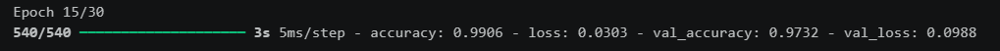
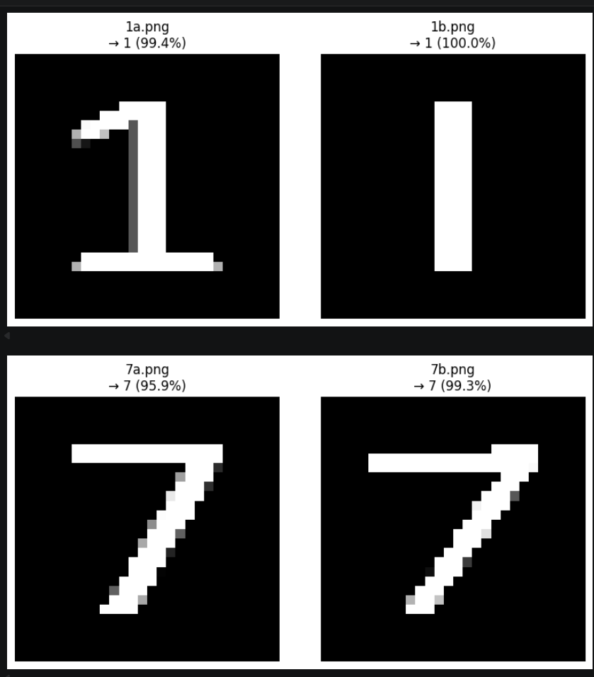
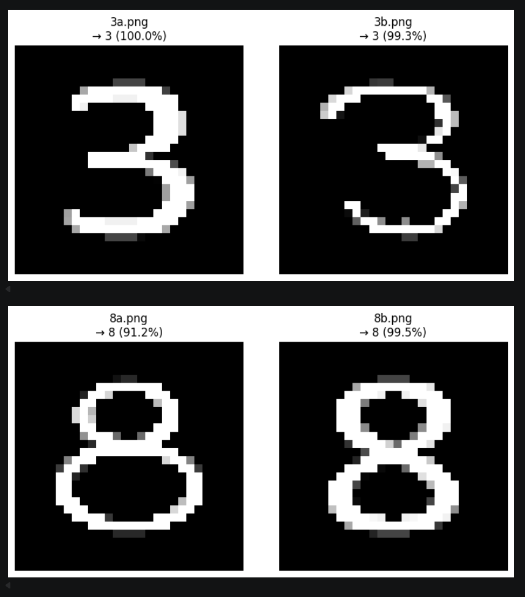

# Laboratorium nr 3 – Klasyfikacja cyfr MNIST

---

## Wyniki treningu

Model zatrzymał się po **15 epokach** (early stopping, val_loss przestało maleć po epoce 13).

| Metryka | Wynik |
|---------|-------|
| Dokładność treningowa (ostatnia epoka) | ~99.23% |
| Dokładność walidacyjna | ~96.82% |
| **Dokładność testowa** | **96.90%** |
| Test loss | 0.11 |

---

## Test na własnych obrazkach

Model przetestowany na własnoręcznie narysowanych cyfrach: 1, 3, 7, 8 (po dwa warianty każdej) przy użyciu biblioteki `opencv-python` i metody `model.predict()`.

---

## Wnioski

- Prosta sieć gęsta z dwiema warstwami ukrytymi po 50 neuronów osiąga **~97%** na zbiorze testowym MNIST — dobry wynik jak na tak prostą architekturę.
- Early stopping skutecznie zapobiegł przeuczeniu — val_loss przestało maleć po epoce 13, a trening zatrzymał się po epoce 15. Parametr `restore_best_weights=True` gwarantuje, że zapisany model pochodzi z najlepszej epoki, a nie ostatniej.
- ReLU jako funkcja aktywacji zapewnia szybką zbieżność i nie powoduje problemu zanikającego gradientu.
- Softmax na wyjściu daje rozkład prawdopodobieństwa po wszystkich 10 klasach, co pozwala ocenić nie tylko odpowiedź modelu, ale też jego pewność.
- Model poprawnie rozpoznaje własnoręcznie narysowane cyfry, pod warunkiem że kreska jest wyraźna i gruba.
- Cyfry podobne kształtem (np. 1 i 7, 3 i 8) bywają mylone przy niskiej jakości rysunku — model zwraca wtedy niższą pewność predykcji.
- Preprocessing ma kluczowe znaczenie: samo skalowanie obrazka bez przycinania do granicy cyfry dawało błędne wyniki, ponieważ duże marginesy rozmywały cyfrę po przeskalowaniu do 28×28.
- Model jest wrażliwy na styl pisania — cyfry pisane inaczej niż w zbiorze treningowym (np. siódemka z kreską) mogą być błędnie klasyfikowane.
