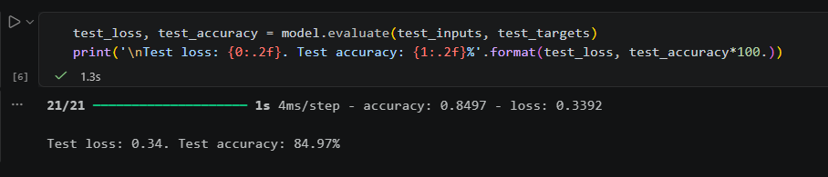
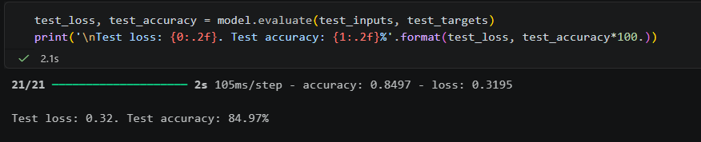

# Laboratorium nr 4 – Praca z danymi

---

## Pierwsze uruchomienie

| Metryka | Wynik |
|---------|-------|
| Test loss | 0.38 |
| **Test accuracy** | **79.46%** |

---

## Drugie uruchomienie – po zmianach

Wprowadzone zmiany:
- `hidden_layer_size`: 50 → **150**
- `EarlyStopping`: patience=2 → **patience=5, restore_best_weights=True**

| Metryka | Przed | Po zmianach |
|---------|-------|-------------|
| Test loss | 0.38 | **0.32** |
| **Test accuracy** | **79.46%** | **84.97%** |

Wynik poprawił się o ~5.5%, ale cel >90% nie został jeszcze osiągnięty.