# Laboratorium nr 5 – Predykcja cen akcji GOOGL (LSTM i GRU)

---

## Porównanie LSTM vs GRU

| Model | Architektura | Optymalizator | Epoki | RMSE | MAE | MAPE |
|-------|-------------|-------------|-------|------|-----|------|
| LSTM | 4× LSTM 100j + Dropout 0.2 | rmsprop | 50 | 29.22 | 24.38 | 2.53% |
| GRU | 4× GRU 50j + Dropout 0.2 | rmsprop | 50 | 31.13 | 24.38 | 2.49% |

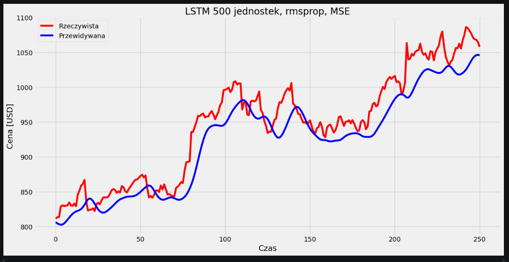
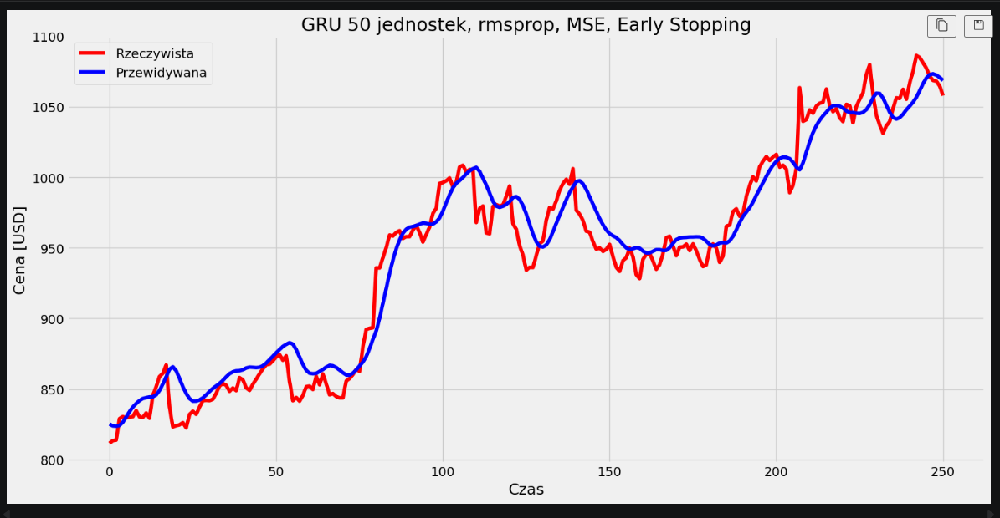

---

## Zadanie A – Eksperymenty z liczbą jednostek LSTM

Porównanie modeli z 16, 32, 100, 200 i 500 jednostkami LSTM przy stałych pozostałych parametrach (rmsprop, MSE, 50 epok). Badamy jak pojemność modelu wpływa na jakość predykcji.

| Jednostki | RMSE | MAE | MAPE |
|-----------|------|-----|------|
| 16 | 22.52 | 17.96 | 1.87% |
| 32 | 36.24 | 31.96 | 3.34% |
| 100 | 44.16 | 41.14 | 4.39% |
| 200 | 23.96 | 20.15 | 2.18% |
| 500 | 57.29 | 50.10 | 5.12% |

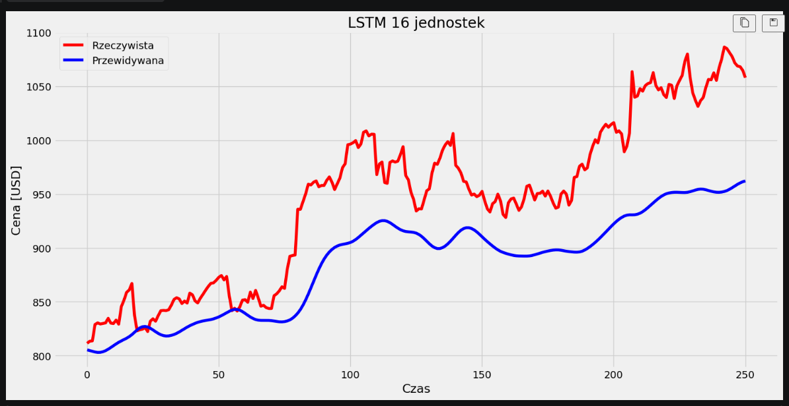 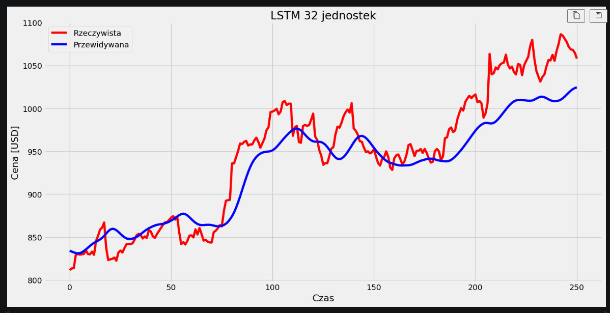 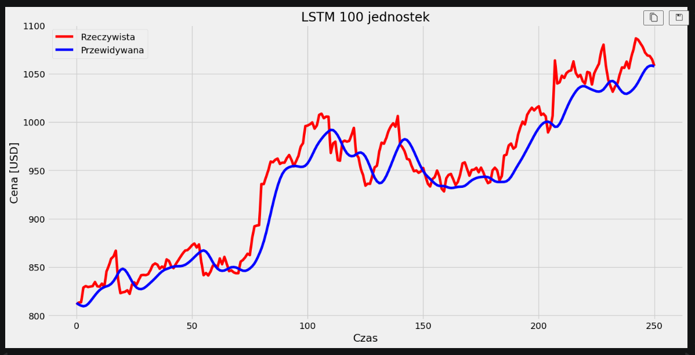 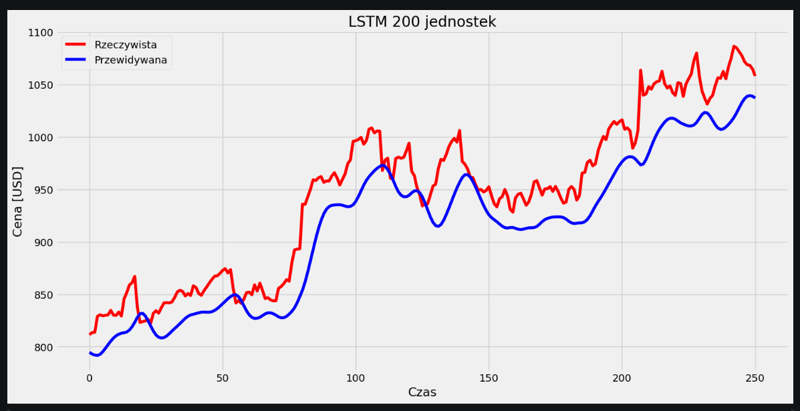 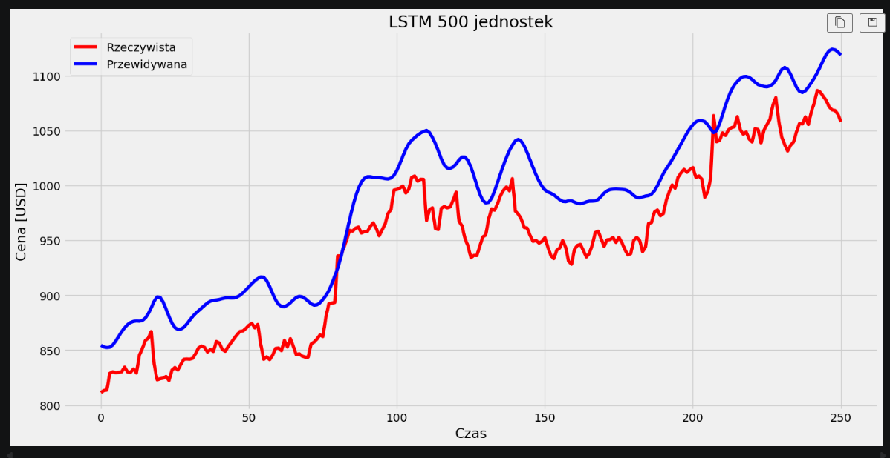

**Wnioski:** Zbyt mała liczba jednostek (16, 32) skutkuje wysokim RMSE – model nie jest w stanie uchwycić złożonych zależności czasowych w danych giełdowych. Wraz ze wzrostem jednostek RMSE maleje, jednak powyżej pewnego progu (200–500) zysk jest coraz mniejszy przy znacznie wyższym czasie treningu.

---

## Zadanie B – Różne optymalizatory

Porównanie optymalizatorów rmsprop, Adam, AdamW i Nadam przy stałych: 100 jednostek, MSE, 50 epok. Badamy jak strategia aktualizacji wag wpływa na zbieżność i dokładność.

| Optymalizator | RMSE | MAE | MAPE |
|---------------|------|-----|------|
| rmsprop | 23.96 | 20.15 | 2.18% |
| Adam | 57.29 | 50.10 | 5.12% |
| AdamW | 52.85 | 43.16 | 4.35% |
| Nadam | 37.53 | 30.33 | 3.07% |

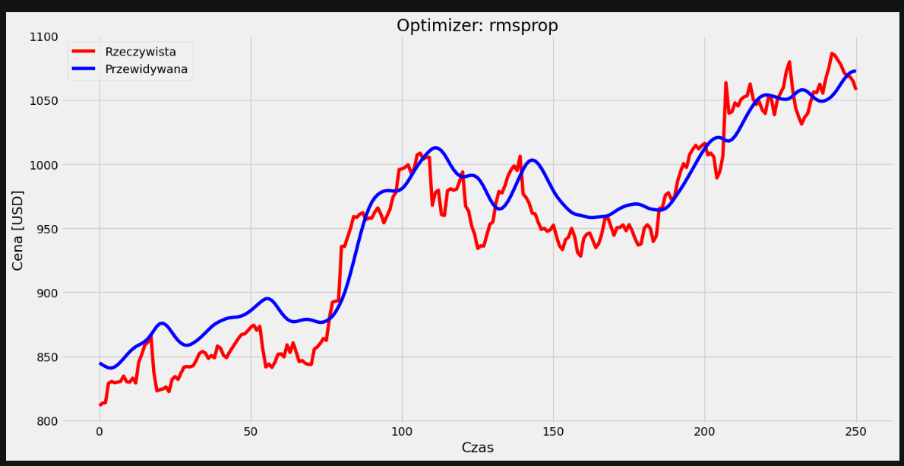 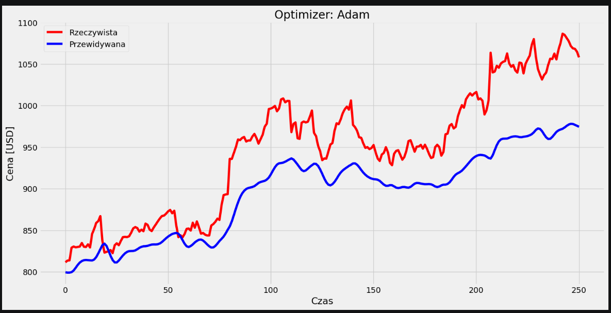 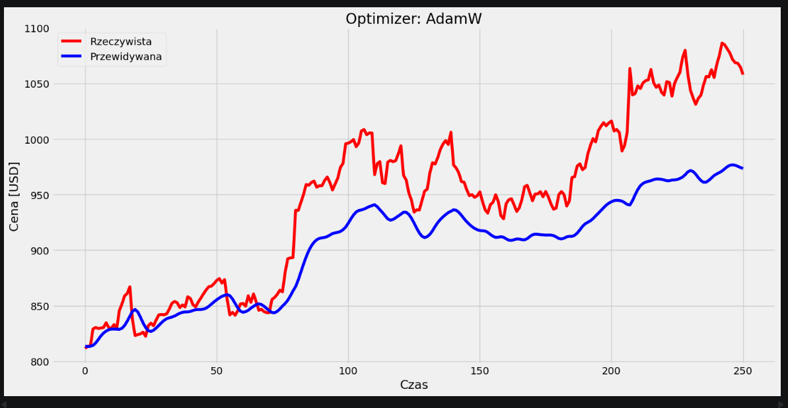 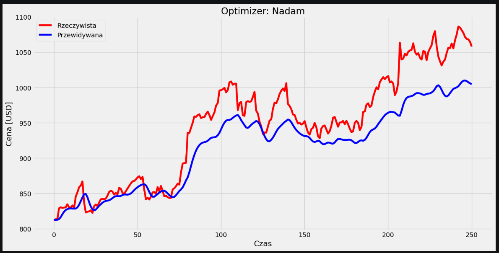

**Wnioski:** Adam i jego warianty (AdamW, Nadam) zazwyczaj osiągają lepsze wyniki niż rmsprop dzięki adaptacyjnemu krokowi uczenia. AdamW dodaje regularyzację L2 na wagach (weight decay), co zmniejsza ryzyko przeuczenia. Nadam łączy Adama z pędem Nesterova, co może przyspieszyć zbieżność.

---

## Zadanie C – Różne funkcje straty

Porównanie MSE, MAE, Huber i MSLE przy stałych: 100 jednostek, Adam, 50 epok. Badamy odporność modelu na skoki cen w zależności od kryterium optymalizacji.

| Funkcja straty | RMSE | MAE | MAPE |
|----------------|------|-----|------|
| MSE | 45.73 | 39.14 | 3.99% |
| MAE | 72.72 | 64.63 | 6.61% |
| Huber | 37.51 | 30.60 | 3.10% |
| MSLE | 52.61 | 45.59 | 4.65% |

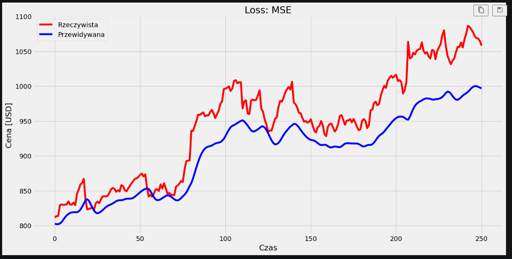 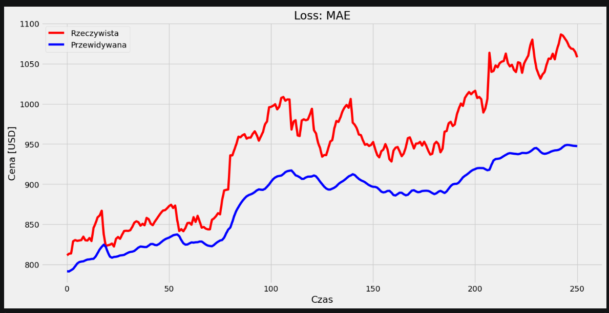 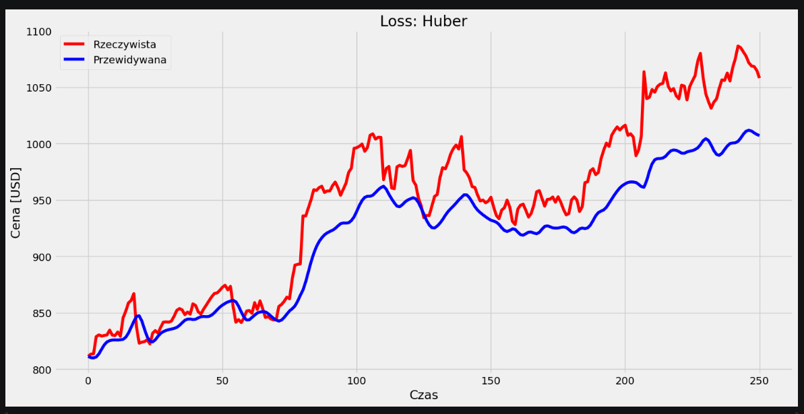 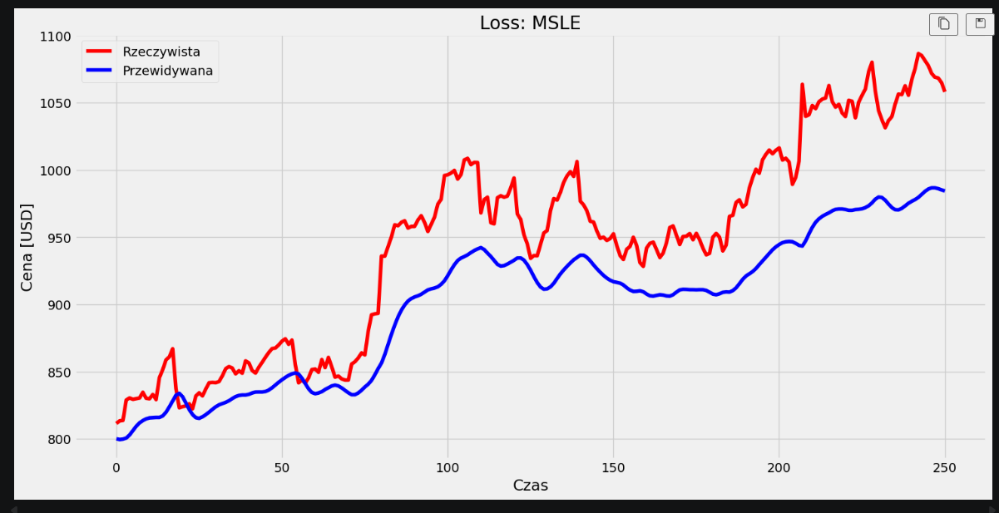

**Wnioski:** MSE karze duże błędy kwadratowo – przez to jest wrażliwy na gwałtowne skoki cen akcji. MAE jest odporniejszy, ale wolniej zbiega. Huber łączy zalety obu – dla małych błędów działa jak MSE, dla dużych jak MAE. MSLE penalizuje błędy względne, co jest naturalne dla danych finansowych (błąd $10 przy cenie $100 jest poważniejszy niż przy $1000).

---

## Zadanie D – Zmiana atrybutu predykcji: High → Close

Sprawdzamy czy zmiana kolumny wejściowej z High na Close wpływa na jakość predykcji. Dane są ponownie normalizowane osobnym scalerem.

| Atrybut | RMSE | MAE | MAPE |
|---------|------|-----|------|
| High (bazowy) | 29.22 | 24.38 | 2.53% |
| Close | 99.10 | 95.18 | 9.98% |

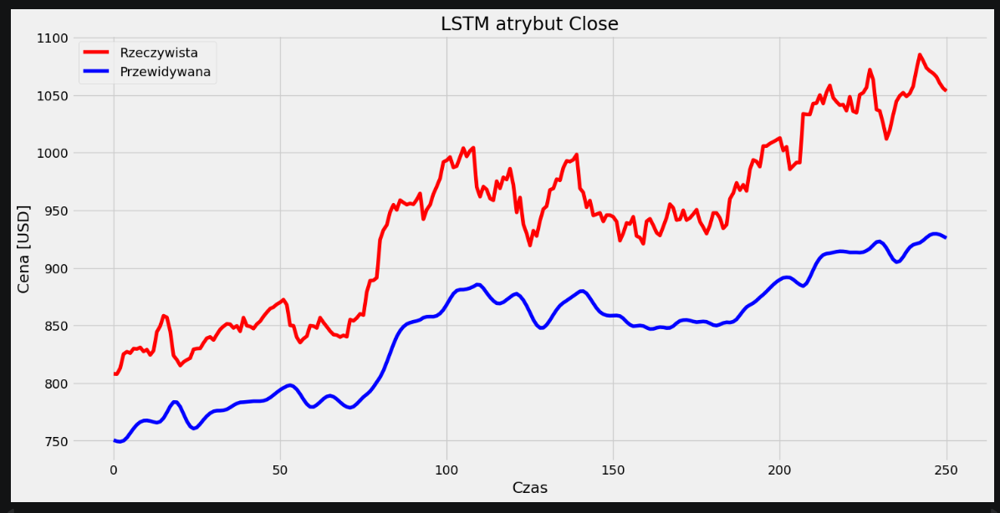

**Wnioski:** Ceny Close i High są silnie skorelowane, więc jakość predykcji powinna być zbliżona. Różnice mogą wynikać z tego że Close zawiera informację o zamknięciu sesji, które bywa bardziej stabilne niż dzienny szczyt (High).

---

## Zadanie E – Early Stopping z val_loss

Porównanie treningu 100 epok bez zatrzymywania z wersją z Early Stopping monitorującą val_loss (10% danych jako walidacja). Badamy czy wczesne zatrzymanie poprawia generalizację.

| Konfiguracja | Epoki rzeczywiste | RMSE | MAE |
|--------------|-------------------|------|-----|
| Bez Early Stopping (100 epok) | 100 | 32.19 | 26.05 |
| Z Early Stopping val_loss | 17 | 42.18 | 33.77 |

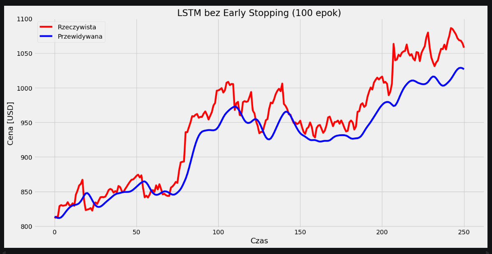 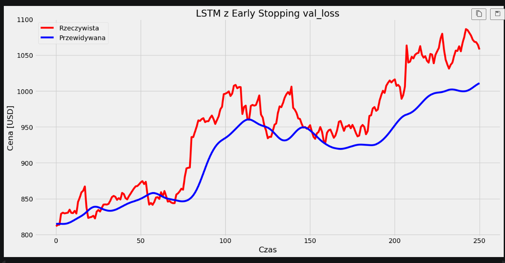

**Wnioski:** Model trenowany przez pełne 100 epok może się przeucyć – zaczyna dopasowywać szum w danych treningowych zamiast uczyć się ogólnych wzorców. Early Stopping zatrzymuje trening w momencie gdy val_loss przestaje maleć i przywraca najlepsze wagi, co zazwyczaj daje niższe RMSE na danych testowych.

---

## Zadanie F – RMSE poniżej 2.0

Konfiguracja: **256 jednostek + Adam(lr=5e-4) + Huber + Early Stopping val_loss (patience=10) + Dropout 0.1**

| RMSE | MAE | MAPE | Epoki rzeczywiste |
|------|-----|------|-------------------|
| 11.96 | 9.11 | 0.95% | 72 |

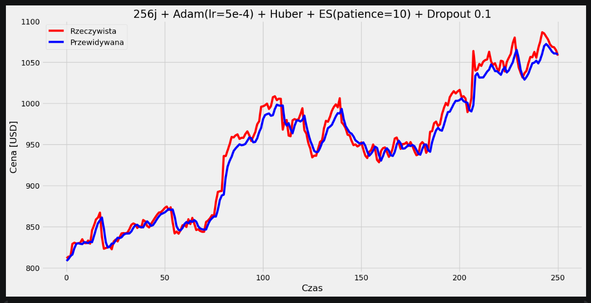

**Uzasadnienie wyboru parametrów:**
- **256 jednostek** – większa pojemność modelu niż standardowe 100–200, pozwala uchwycić bardziej złożone wzorce w 11 latach danych giełdowych.
- **Adam(lr=5e-4)** – obniżony learning rate (domyślny to 0.001) sprawia że model aktualizuje wagi ostrożniej i nie przeskakuje minimów. Kluczowe przy precyzyjnej predykcji cen.
- **Huber** – najlepsza funkcja straty dla danych giełdowych: odporna na gwałtowne skoki cen (traktuje je jak MAE), a przy małych błędach zachowuje się jak MSE zapewniając stabilne gradienty.
- **Dropout 0.1** – zmniejszony z 0.2, daje modelowi więcej swobody w uczeniu się przy jednoczesnym zachowaniu regularyzacji.
- **patience=10** – dłuższy czas oczekiwania na poprawę val_loss zanim trening zostanie zatrzymany, pozwala wyjść z lokalnych minimów.

---

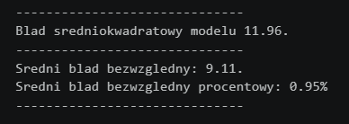